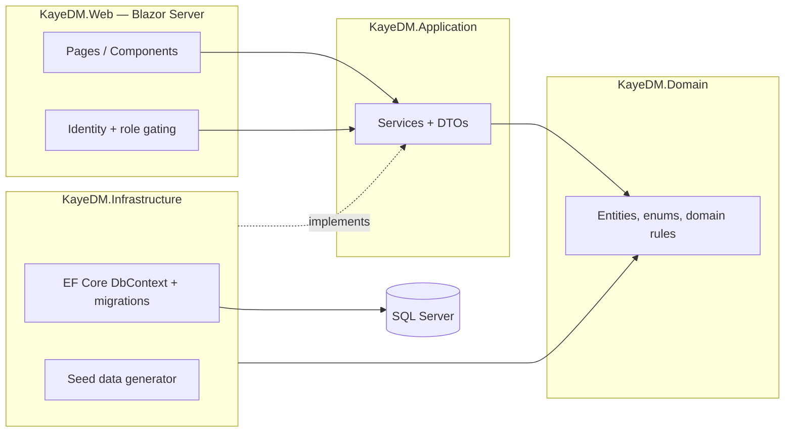
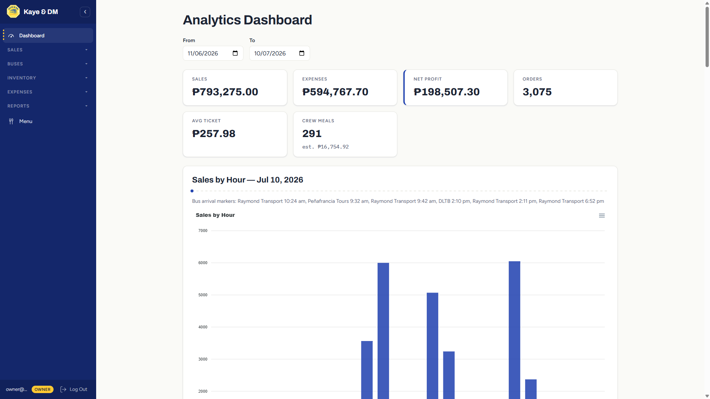
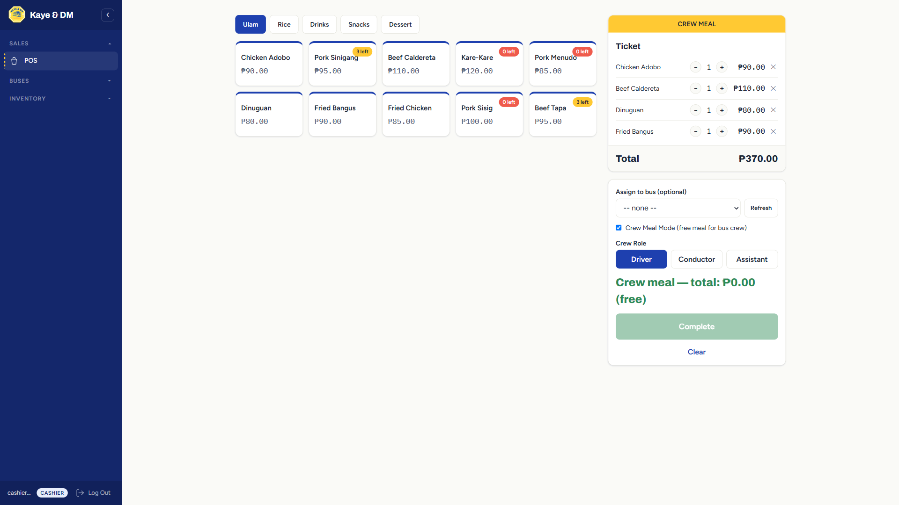
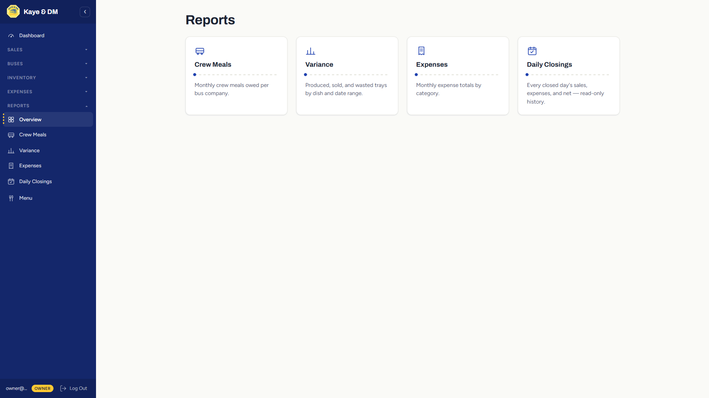
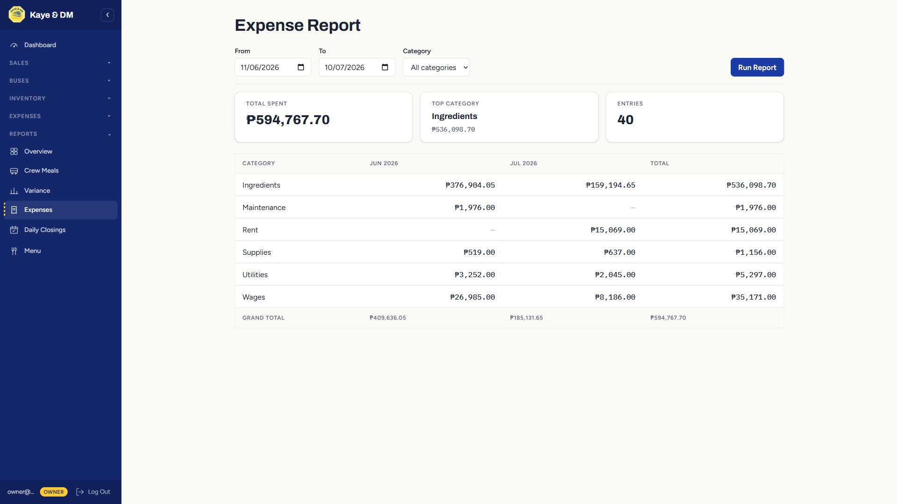
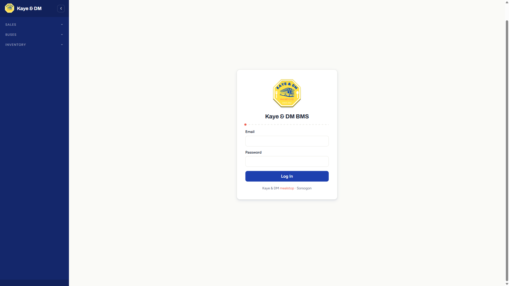

# Kaye & DM BMS

Management system for a provincial bus meal stop in Sorsogon, Philippines.

This is a ground-up rebuild of my VB.NET / .NET Framework / MySQL capstone project from school, redone in ASP.NET Core 8 as a portfolio piece — the same domain, modeled the way I'd actually build it now, with the modernization habits (layered architecture, EF Core migrations kept as history, a real test suite, containerized deployment) that legacy .NET shops are hiring for.

[Live demo] · [45s demo GIF] — coming soon; run it locally with the one-liner below in the meantime.

## The domain (why this isn't a POS tutorial)

A bus meal stop is not a normal restaurant:

- **Demand arrives in waves.** Three buses pull in at once; 150 passengers order, eat, and leave in 20–30 minutes, then it's dead until the next wave. The POS is built for that rush (see Highlights below), and the dashboard's sales-by-hour chart overlays bus arrival times on the sales curve to make the wave pattern visible at a glance.
- **Bus crews eat free.** Feeding drivers and conductors at no charge is the incentive for a bus line to stop here — that's a real accounting obligation, not a courtesy. Crew meals are capped per company per trip, credited against a monthly allowance, and rolled up into a per-company report so the owner can see exactly what "free crew meals" costs in pesos.
- **Inventory is tray-based, not SKU-based.** Food is cooked in batches — "3 trays of adobo" — and what matters operationally is trays produced vs. sold vs. wasted per day, not per-ingredient stock deduction.

## Stack

ASP.NET Core 8 · Blazor Server (Interactive Server render mode) · EF Core 8 · SQL Server · Docker

- **UI:** Blazor Server — interactive POS without a JS SPA, low-latency on a single server.
- **Charts:** [Blazor-ApexCharts](https://github.com/apexcharts/blazor-apexcharts) (MIT), the only third-party UI package in the project.
- **Auth:** ASP.NET Core Identity, two seeded roles (Owner, Cashier) — just enough to demonstrate role-gating, no registration flow.
- **Testing:** xUnit + FluentAssertions, SQLite in-memory for service-level tests.

## Architecture



Full write-up, including the layering rule and every ADR-lite decision, in [docs/architecture.md](docs/architecture.md).

## Highlights

- **POS designed for the rush:** big-button menu grid grouped by category, running ticket with quantity steppers, Cash/GCash payment strip with quick-tender buttons and instant change calculation, crew-meal mode that flips the ticket header to an unmissable yellow banner.
- **Crew meal crediting with per-company allowance rules** — domain-tested, not just UI-enforced: a trip can't be credited past its bus company's monthly allowance.
- **Tray-based inventory** with a live availability strip on the POS (red at ≤5 servings left) and a produced/sold/wasted variance report per dish.
- **Expense tracking with daily net-profit closing snapshots** — once a day is closed, orders, voids, and expenses on or before that date lock permanently.
- **Analytics dashboard:** sales-by-hour with bus-arrival markers overlaid (the chart that proves the wave pattern), 30-day revenue/expense/net trend, per-bus-company sales (including a "wave-attributed" heuristic for unassigned orders), and rule-based insight callouts — no AI, just computed thresholds.
- **10 real EF Core migrations kept as schema history** (see below) — this repo is also the test corpus for a companion project, an EF Core migration safety checker that audits its own migration history for production-dangerous patterns.

## EF Core migrations as a feature

Migrations are never squashed or regenerated in this repo. All 10 are kept in git, reflecting the schema's real evolution week over week (adding a table, backfilling a column, converting a plain int to a real foreign key, splitting inventory from waste). See [docs/architecture.md](docs/architecture.md) for the migration policy and the full list.

## Screenshots

| | |
|---|---|
|  |  |
|  |  |



## Run it

Requires Docker (and nothing else — no local .NET SDK or SQL Server install needed).

```bash
docker compose up
```

This builds the app image, starts SQL Server, applies all 10 migrations, and seeds 30 days of demo data (waves, crew meals, trays, expenses) the first time the database is empty. Then open **http://localhost:8080**.

Seeded logins (same password for both):

| Role    | Email                  | Password     |
|---------|------------------------|--------------|
| Owner   | `owner@kayedm.local`   | `KayeDM#2026` |
| Cashier | `cashier@kayedm.local` | `KayeDM#2026` |

Owner sees the full app (dashboard, reports, expenses, menu management); Cashier sees only POS, bus arrivals, and inventory production/waste — the two roles a real shift would actually need.

### Running without Docker

If you have the .NET 8 SDK and a local SQL Server / LocalDB instance:

```bash
cd KayeDM.BMS
dotnet ef database update --project src/KayeDM.Infrastructure --startup-project src/KayeDM.Web
dotnet run --project src/KayeDM.Web -- --seed   # wipes and reseeds 30 days of demo data
dotnet run --project src/KayeDM.Web
```

### Running the tests

```bash
cd KayeDM.BMS
dotnet test
```

## Demo flow

A mechanical, numbered walkthrough (bus arrives → rapid orders → crew meal → owner reviews the day) is in [docs/demo-script.md](docs/demo-script.md).

## Out of scope

Offline mode, receipt printers, cash drawers, real payment gateways, multi-branch, ingredient-level recipes — see [docs/kaye-dm-bms-blueprint.md](docs/kaye-dm-bms-blueprint.md) §13 for the full list and why each is cut. If it doesn't serve the 45-second demo or an interview question, it isn't here.

---

**Author:** Alfred Nobel Galido — [github.com/Nobelgalido](https://github.com/Nobelgalido)
