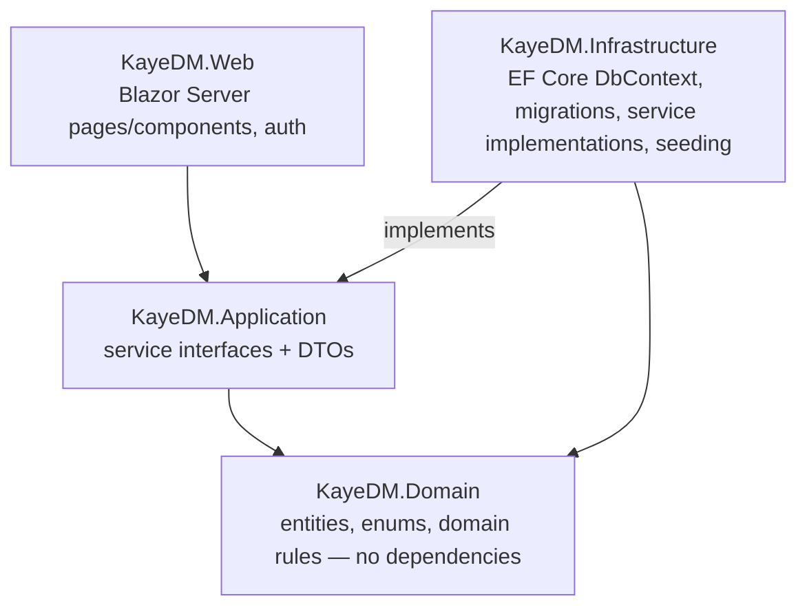

# Architecture

## Layering

**The rule:** Web talks to Application interfaces only; it never references Infrastructure or EF Core directly. Domain has no dependencies at all — no EF Core, no ASP.NET Core, nothing. Infrastructure implements Application's interfaces and is the only project that knows SQL Server exists. This is enforced by convention, not by a separate abstraction layer — no MediatR, no repository-over-repository wrapping. Plain services with constructor injection throughout.

## ADR-lite decisions

Short decision + rationale, not full ADR documents.

- **Client-side aggregation for decimal sums in EF Core queries.** `ClosingService` and `DashboardService` never call `.SumAsync()` or `GroupBy(...).Select(g => g.Sum(...))` directly against `IQueryable<T>` when the summed column is `decimal`. Instead, every such query first does the `Where` filter and a narrow `Select` projection (only the columns actually needed) in SQL, materializes with `.ToListAsync()`, then sums/groups client-side with LINQ-to-Objects. Reason: the SQLite EF Core provider (used by the xUnit test suite) cannot translate `SUM` over `decimal` into SQL and throws `NotSupportedException` — SQL Server supports it fine, so this only surfaces in tests, not production. Keeping the pattern consistent between test and production code paths (rather than only fixing what SQLite complains about) avoids the query behaving differently depending on provider, and the narrow projection keeps the client-side materialization cheap even though it's no longer a pure server-side aggregate.

- **Blazor Server over a JS SPA.** The POS needs to feel instant during a wave (six orders a minute), but it's a single-location, single-server deployment with no offline requirement — Blazor Server's low-latency interactive model fits without paying for a separate API layer, a JS build pipeline, or a client-side state management story. The tradeoff (a persistent SignalR connection per user) is a non-issue at this scale.

- **No pattern libraries.** No MediatR, no AutoMapper, no generic repository wrapping EF Core. A junior portfolio repo drowning in patterns for a CRUD-shaped domain reads as cargo-culting rather than engineering judgment. Plain services with constructor injection are enough here, and they keep the layering rule (above) easy to actually verify by reading the code.

- **Tray-based inventory, not ingredient-level.** `DishBatch` tracks trays produced and servings per tray for a dish; nothing decrements per-ingredient stock. This matches how the business actually runs (food is cooked in batches, not assembled from a recipe at order time) and keeps the domain model proportional to what the 45-second demo needs to show. Ingredient-level recipes are explicitly out of scope (blueprint §13).

- **Oversell override, not a hard block.** Selling past a batch's computed availability shows a confirm-override warning on the POS but is still allowed — real canteens oversell trays when the wave is bigger than expected, and a hard block would fight how the business actually copes with demand spikes. The override is flagged on the order (`OversoldOverride`) so it's visible in reporting, not silently absorbed.

- **Migration history is never squashed.** All 10 EF Core migrations are kept in git from Week 1 through Week 4, reflecting real incremental schema evolution (adding a table, backfilling a column, converting `Order.BusTripId` from a plain `int` to a real FK once `BusTrip` existed, splitting waste logging into its own migration from dish batches). A wrong migration gets a corrective migration, never an edit or a delete. This repo doubles as the test corpus for a companion project — an EF Core migration safety checker that audits a migration history for production-dangerous patterns — so a clean, real history is the point, not an accident.

- **Fixed-frame layout for report pages.** `/buses/report`, `/inventory/variance`, `/expenses/report`, and `/closing/history` share one layout pattern: a sticky filter bar, a KPI summary strip, and a table region that scrolls internally instead of the page scrolling. At 1366×768 (the assumed canteen-laptop viewport) the page itself never scrolls — only the data table does, with a sticky header row. This was built once as a shared component set (`ReportFilterBar`, `KpiCard`, `ReportTableFrame`, `ReportEmptyState`) and reused across all four pages rather than four separate layouts.

- **Design tokens over a component library.** No Tailwind, no MudBlazor or other Blazor component library — the "Filipino highway signage" visual system (route-blue, signal-yellow accents, the dashed route-line motif) is implemented as plain CSS custom properties in `app.css` plus a handful of hand-built shared components (`PageHeader`, `KpiCard`, badges, empty states). Global overrides on Bootstrap's own `.btn`/`.form-control` classes mean every `EditForm` across the CRUD pages inherits the design system automatically, without per-page markup rewrites.
